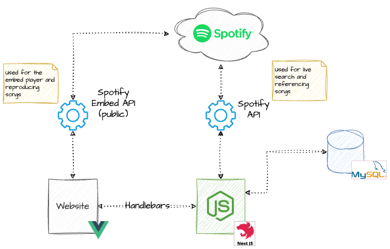

# MyGoldenRecord

El código de este proyecto es privado. Este repositorio público contiene únicamente documentación.

### Descripción

MyGoldenRecord es una aplicación web para que los usuarios elaboren su lista de canciones favoritas y puedan compartirlas públicamente o exploren las de otros usuarios.

#### Demo
[Ver en Youtube](https://www.youtube.com/watch?v=zrzwJqBAxG8)

#### Descripción técnica

El siguiente diagrama describe brevemente la arquitectura de la aplicación:

